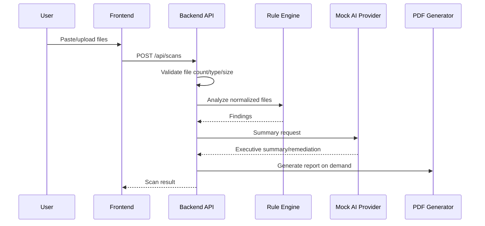

# Architecture

SecureStack AI is a monorepo with a React/TypeScript frontend and Java 21 Spring Boot backend. The backend exposes REST endpoints, validates untrusted files, runs rule classes, scores risk, invokes an AI provider abstraction, persists scan metadata/findings in H2 locally, and generates PDF reports.

## Sequence

## Data model
Scan, finding, severity, category, confidence, status, and risk level are represented as typed Java domain objects and DTOs.
