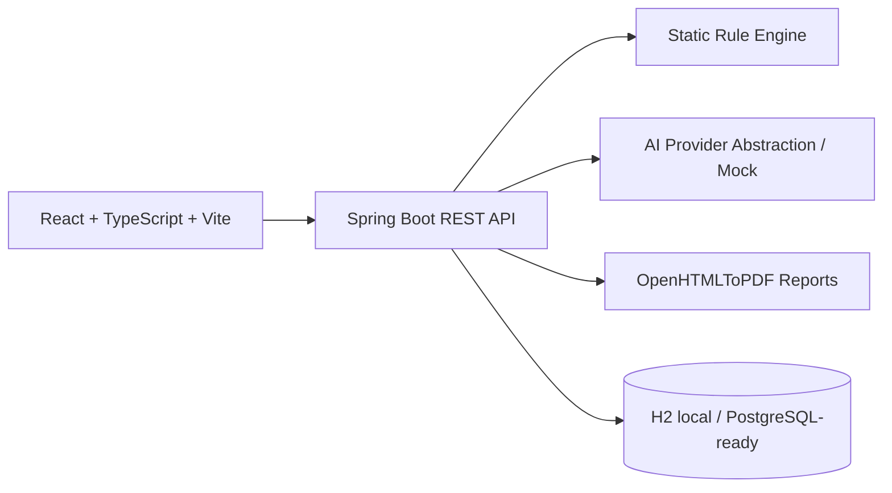

# SecureStack AI

  

SecureStack AI is an AI-assisted security review platform that scans software project files for application, dependency, API, Docker, and cloud/IaC risks. It combines Java/Spring static rules with deterministic mock AI summaries and PDF report generation so it runs locally with no OpenAI, AWS, or deployment credentials.

## Features
- Paste files, upload files, or upload ZIP archives.
- Detect hardcoded secrets, wildcard CORS, weak JWTs, risky auth endpoints, SQL/command injection patterns, public S3 and permissive IAM, insecure Dockerfiles, suspicious dependency scripts, debug mode, and sensitive logging.
- Risk score from 0-100 with severity/category breakdowns.
- Mock AI executive summaries by default via `AI_PROVIDER=mock`.
- PDF security review reports.
- Docker Compose and GitHub Actions CI.

## Architecture


## Quick start
```bash
docker compose up --build
```
Open http://localhost:5173.

Backend only:
```bash
cd backend
mvn spring-boot:run
mvn test
mvn package
```
Frontend only:
```bash
cd frontend
npm install
npm run dev
npm run test
npm run lint
npm run build
```

## Environment
Copy `.env.example`. Defaults use mock AI, H2, and no raw file persistence. `STORE_RAW_FILES=false` means the intended storage policy is metadata, hashes, sanitized previews, findings, summaries, and reports rather than raw uploaded secrets.

## Sample scans
Use `samples/vulnerable-node-api`, `samples/vulnerable-spring-api`, `samples/insecure-docker`, and `samples/insecure-terraform` to demonstrate high-value findings. Use `samples/clean-example` to demonstrate a low-risk result.

## Deployment readiness
Frontend can deploy to AWS Amplify, S3 + CloudFront, Netlify, or Vercel. Backend is documented for AWS App Runner or ECS Fargate with environment variables and no required AWS credentials for local development.

## Limitations
SecureStack AI is defensive and static. It does not execute uploaded code, does not prove exploitability, does not replace professional security review, and real Bedrock/OpenAI integrations are optional future work.

## Resume bullet
Built SecureStack AI, an AI-assisted security review platform using React, TypeScript, Java Spring Boot, AWS-ready architecture, and LLM-based analysis abstractions to scan project files for application, dependency, API, and cloud security risks; implemented static rule checks, structured risk scoring, PDF report generation, CI/CD, and production documentation.

## LinkedIn post template
I built SecureStack AI, a full-stack AI-assisted security review app that combines React, TypeScript, Java 21, Spring Boot, static security rules, mock LLM summaries, Docker, CI/CD, and PDF reporting. The project focuses on defensive scanning for secrets, API risks, cloud/IaC misconfiguration, and container issues while remaining runnable locally without paid credentials.


## Review depth and focus areas

- `QUICK` runs high-signal critical/high rules for fast triage.
- `STANDARD` runs the normal rule set and skips low-value informational checks.
- `FULL` runs every implemented rule, including broader heuristics.

Focus areas map to rule categories: Application security, Secrets, Dependencies, API security, Cloud/IaC, Docker/container security, and AI-generated explanation. When no focus area is selected, all categories are reviewed.

## Recruiter-facing resume bullet

Built SecureStack AI, a Java 21/Spring Boot and React/TypeScript defensive security review platform with static analysis rules, deterministic mock-AI summaries, risk scoring, PDF reports, Docker Compose, CI, and AWS deployment documentation.

## LinkedIn post template

I built SecureStack AI, a full-stack portfolio project that reviews small codebases for defensive security issues, generates mock-AI executive summaries, and exports PDF reports. It demonstrates Spring Boot, React, TypeScript, Docker, CI/CD, cloud-readiness, and practical secure engineering.
