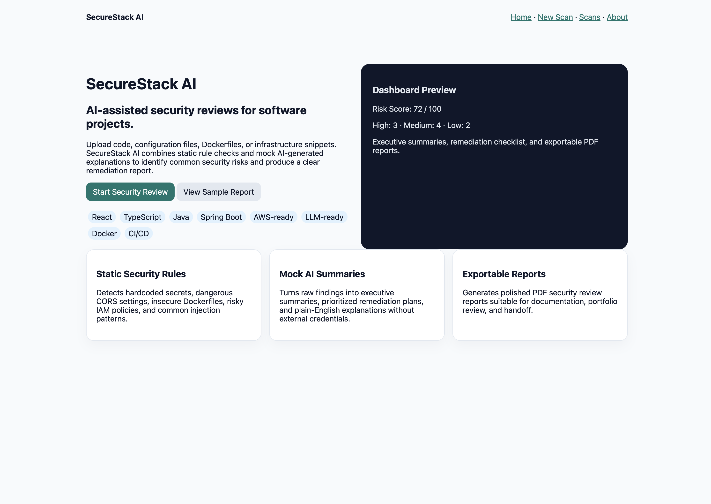
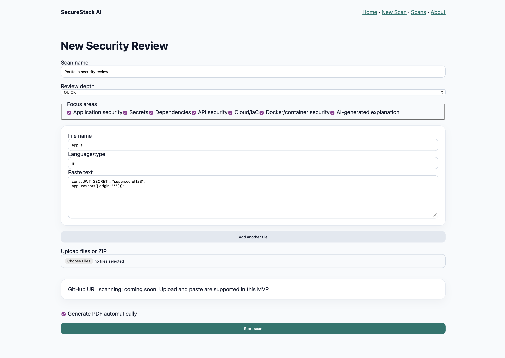
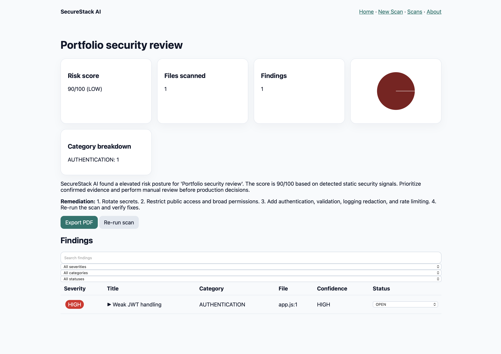
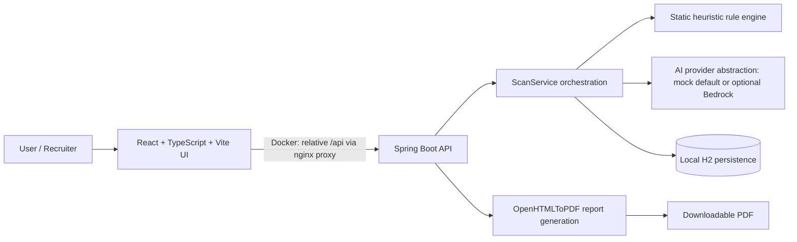

# SecureStack AI

SecureStack AI is a full-stack defensive security review app that analyzes pasted or uploaded source/configuration files, summarizes heuristic findings, and exports a recruiter-friendly PDF report.

## Screenshot gallery

The screenshots below were added after local Docker validation and are stored in [`docs/screenshots/`](docs/screenshots/).

| View | Screenshot |
| --- | --- |
| Landing page |  |
| New scan form |  |
| Results dashboard |  |
| PDF report |  |
| Scan history |  |

## Why I built this

I built SecureStack AI to demonstrate production-minded full-stack engineering in a security context: clean React UI composition, Java/Spring service boundaries, defensive static analysis rules, report generation, Dockerized local runtime, CI, and documentation that clearly separates implemented MVP behavior from future cloud/AI enhancements.

## Current features

Implemented now:

- Pasted or uploaded file review for source code, Dockerfiles, Terraform, properties files, and environment-style configuration.
- Results dashboard with risk score, severity summary, category breakdown, finding details, filters, and status updates.
- Scan history and scan retrieval by ID.
- PDF report export with executive summary, findings, remediation checklist, methodology, limitations, and disclaimer.
- Mock AI summaries by default with no external credentials required.
- Optional Amazon Bedrock summaries after manual AWS credentials, region, and model access are configured.
- Docker Compose local runtime with nginx serving the frontend and proxying `/api` to the backend.
- CI for backend tests/package and frontend install/lint/test/build.

## Tech stack

- **Frontend:** React, TypeScript, Vite, Vitest, Testing Library, nginx for Docker serving/proxying.
- **Backend:** Java 21, Spring Boot, Maven, H2/local persistence, OpenHTMLToPDF.
- **Security analysis:** Defensive heuristic rule classes for common application, cloud/IaC, and container misconfiguration indicators.
- **DevOps:** Docker Compose and GitHub Actions CI.

## Architecture overview



The architecture intentionally keeps controllers thin, scan orchestration in services, detection logic in rule classes, and frontend API types centralized.

## How it works

1. A user opens the landing page and starts a new security review.
2. The frontend submits pasted/uploaded files to `POST /api/scans`.
3. The backend validates inputs, treats all files as untrusted, and does not execute uploaded code.
4. Rule classes emit defensive findings with severity, category, evidence, and remediation guidance.
5. The configured AI provider creates a summary: mock by default, or optional Bedrock when explicitly enabled.
6. The frontend navigates to `/scans/{scanId}` and loads results from `GET /api/scans/{scanId}`.
7. Users can filter findings, update finding status, review scan history, and export a PDF report.

## Security checks implemented

Heuristic rules currently look for indicators such as:

- Hardcoded secrets and `.env` style secrets.
- Wildcard CORS.
- Insecure cookie flags.
- Debug exposure.
- SQL injection and command execution patterns.
- JWT/auth misconfiguration indicators.
- Sensitive logging.
- Missing rate limiting indicators.
- Wildcard IAM permissions.
- Public S3 configuration.
- Open security group exposure.
- Dockerfile missing non-root user controls.
- Risky dependency lifecycle scripts.

These checks are defensive triage signals, not a substitute for professional security review.

## Quick start with Docker

```bash
docker compose config
docker compose build
docker compose up
```

Open `http://localhost:5173`. The frontend container serves the Vite build through nginx and proxies `/api` to the backend service. Backend health remains available at `http://localhost:8080/api/health`.

## Local development

Run the backend:

```bash
cd backend
mvn spring-boot:run
```

Run the frontend:

```bash
cd frontend
npm ci
npm run dev
```

Open `http://localhost:5173`. The Vite dev server proxies `/api` to `http://localhost:8080`.

## Testing

```bash
cd backend && mvn test
cd backend && mvn package
cd frontend && npm ci
cd frontend && npm run lint
cd frontend && npm run test
cd frontend && npm run build
```

## Sample scans

Use the projects under [`samples/`](samples/) to demonstrate clean and intentionally vulnerable inputs. Suggested demo flow:

- Paste `samples/vulnerable-node-api/server.js` for application security findings.
- Review `samples/insecure-terraform/main.tf` for cloud/IaC findings.
- Review `samples/insecure-docker/Dockerfile` for container hardening findings.

See [`docs/sample-findings.md`](docs/sample-findings.md) for expected categories and limitations.

## PDF reports

The results page includes a PDF export action. Reports include the scan name, timestamp, risk score, severity/category breakdowns, files reviewed, findings summary, detailed findings, remediation checklist, methodology, limitations, and disclaimer.

## Security model summary

SecureStack AI treats uploaded files as untrusted, validates upload constraints, avoids executing uploaded code, masks secret-like evidence, escapes report content, and uses mock AI by default. See [`SECURITY_MODEL.md`](SECURITY_MODEL.md) for details.

## Limitations

- Static findings are heuristic and can produce false positives or miss context-dependent issues.
- The MVP uses local persistence and mock AI summaries by default.
- Optional Bedrock summary generation is implemented for manual local setup; OpenAI, authentication, GitHub repository scanning, Semgrep/SARIF ingestion, and production deployment automation remain future work.
- Deployment documentation is guidance only and is not proof that this repository is currently deployed in AWS.

## Future roadmap

Planned future work includes OpenAI provider support, authentication and multi-user storage, GitHub repository ingestion, Semgrep/SARIF import, richer rule tuning, and production AWS deployment automation. See [`ROADMAP.md`](ROADMAP.md).

## Recruiter review guide

Technical reviewers can use [`docs/recruiter-review-guide.md`](docs/recruiter-review-guide.md) to quickly locate the backend scan pipeline, rule engine, frontend dashboard, Docker/nginx setup, PDF generation, CI, tests, security model, and documentation.

## Resume bullet

Built SecureStack AI, a full-stack defensive security review platform using React, TypeScript, Java 21, Spring Boot, Docker, CI, heuristic static analysis, mock AI summaries, and PDF reporting to demonstrate production-minded software engineering, cybersecurity, AI-readiness, and cloud-readiness.

## LinkedIn post template

I built SecureStack AI, a full-stack security review portfolio project that analyzes pasted or uploaded code/configuration files, highlights defensive findings, generates mock summaries by default with optional manually configured Bedrock summaries, and exports PDF reports. The stack includes React, TypeScript, Java 21, Spring Boot, Docker Compose, nginx proxying, CI, and security-focused documentation. It is intentionally scoped as an MVP today, with Bedrock/OpenAI, authentication, GitHub scanning, Semgrep/SARIF, and production AWS deployment documented as future work.

## Troubleshooting link

See [`docs/troubleshooting.md`](docs/troubleshooting.md) for local development, Docker, scan retrieval, and validation notes.


## Optional Amazon Bedrock AI provider

SecureStack AI defaults to `AI_PROVIDER=mock`, which is deterministic, local, and requires no AWS credentials for Docker, tests, or normal development. An optional Bedrock mode can be enabled manually with `AI_PROVIDER=bedrock`, `AWS_REGION`, `BEDROCK_MODEL_ID` (default `amazon.nova-lite-v1:0`), `BEDROCK_MAX_TOKENS`, `BEDROCK_TEMPERATURE`, `BEDROCK_SEND_RAW_CONTENT=false`, and `BEDROCK_TIMEOUT_SECONDS`.

Bedrock prompts are defensive and remediation-focused. By default they send scan metadata, risk score/level, severity and category counts, filenames, finding titles/descriptions, confidence, line numbers, masked evidence, and recommendations. Raw uploaded file contents are not sent unless `BEDROCK_SEND_RAW_CONTENT=true`; that experimental mode is not recommended for real secrets, private code, or sensitive customer data. If credentials, region, model access, or model ID are missing, the backend returns a controlled fallback summary while static findings remain available.
