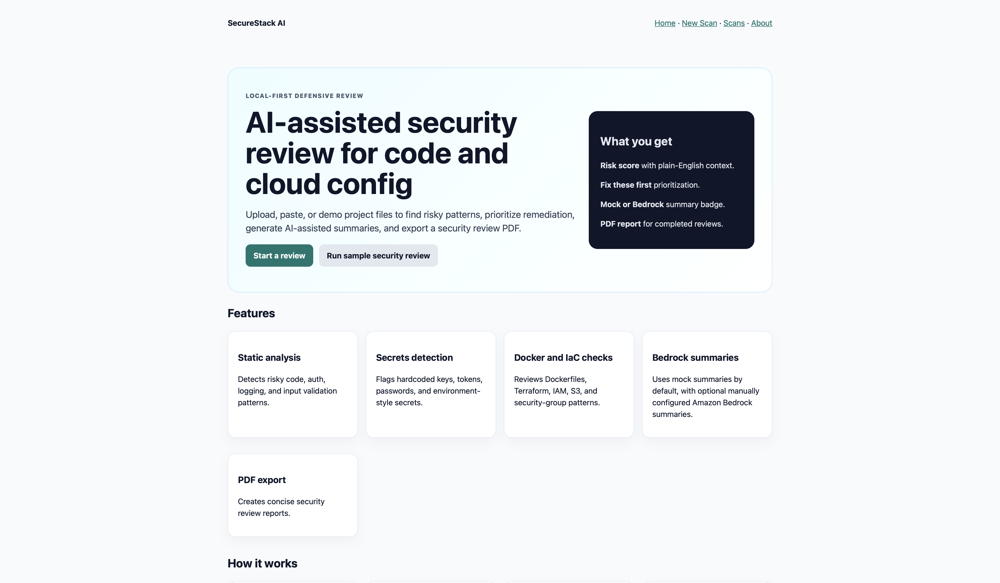
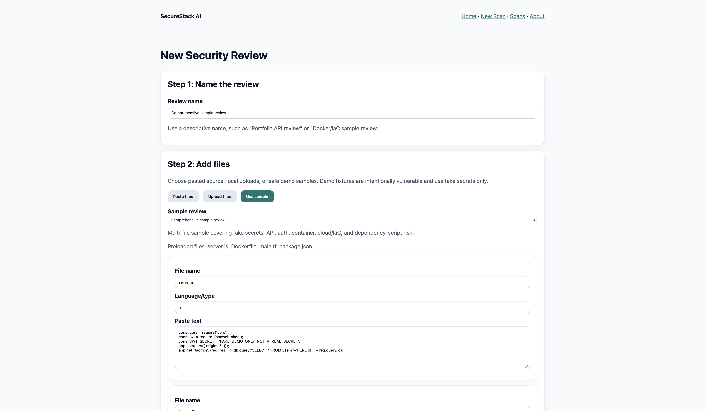
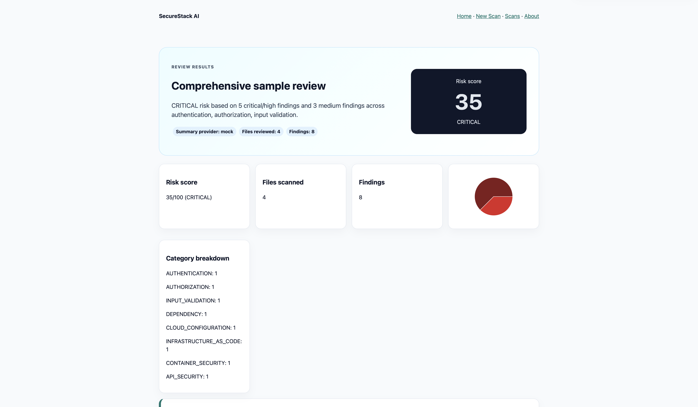
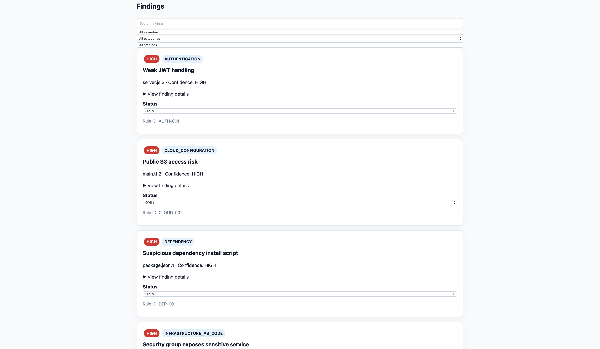
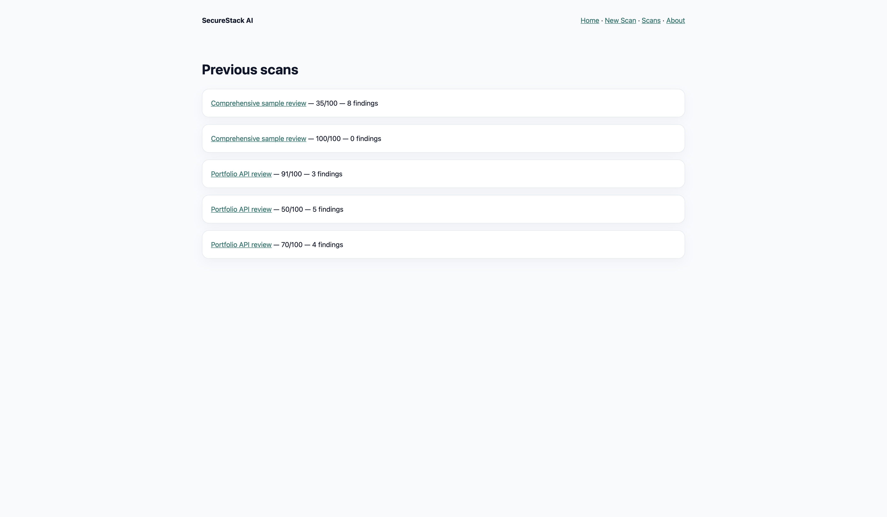
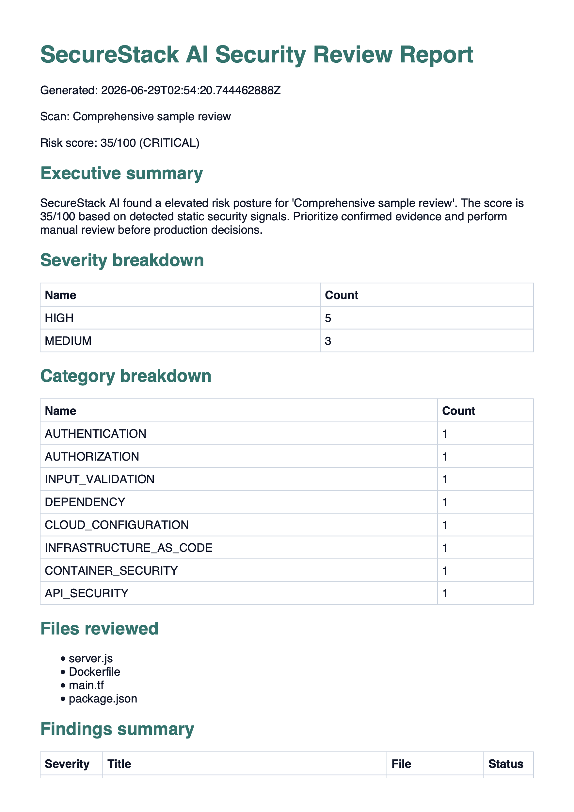

# SecureStack AI

SecureStack AI v0.3-alpha is a local-first defensive security review application for analyzing source and configuration files. It combines a React/Vite frontend, Java 21 Spring Boot API, deterministic static security rules, mock AI summaries by default, optional Amazon Bedrock summaries, and PDF/SARIF report export.

## Features

- Guided scan creation from pasted files, uploaded files/ZIP archives, built-in safe demo samples, or public GitHub repository URLs imported for local analysis of public-only repositories.
- Static checks for secrets, authentication/session risks, API misconfiguration, dependency scripts, Dockerfiles, and cloud/IaC patterns, with a backend/frontend rule catalog.
- Risk scoring, severity/category breakdowns, prioritized findings, and local comparison between completed scans.
- Finding details with evidence, remediation guidance, secure examples, status updates, remediation workflow counts, and rule IDs.
- Mock AI summaries by default, with optional manually configured Amazon Bedrock summaries.
- Real sample report page, PDF report export, and SARIF 2.1.0 JSON export for completed reviews.
- One-command local validation, duplicate/copy artifact guardrails, and GitHub Actions CI validation.

## Tech stack

- **Frontend:** React, TypeScript, Vite, React Router, TanStack Query, Vitest, Testing Library.
- **Backend:** Java 21, Spring Boot, Spring Web, Spring Data JPA, default H2 persistence, optional local PostgreSQL profile, Maven.
- **Security analysis:** Rule classes for deterministic defensive findings plus risk scoring and provider-abstracted AI summaries.
- **Reporting:** Server-generated PDF export and backend SARIF 2.1.0 export.
- **Local runtime:** Docker Compose.
- **Optional cloud AI:** Amazon Bedrock when manually configured.

## Quick start

```bash
docker compose up --build
```

Open `http://localhost:5173` and run the guided sample review.

## Local validation

Run the full local validation workflow with one command:

```bash
./scripts/validate-all.sh
make validate
```

For a faster loop that skips backend packaging and frontend production build:

```bash
./scripts/validate-all.sh --quick
make validate-quick
```

The validation workflow includes duplicate/copy-file guardrails, conservative secret-safety checks, backend tests, frontend lint/tests/build, and Docker Compose configuration checks. GitHub Actions CI mirrors these validation categories for pushes and pull requests to `main`. The duplicate-file guard detects common accidental duplicate names such as `2.java`, `3.tsx`, `copy.*`, `*.orig`, and `*.rej`; it reports matches without deleting files or claiming to know their root cause. Optional local pre-commit hooks can be installed with `./scripts/install-hooks.sh`.

## Local development

Backend:

```bash
cd backend
mvn spring-boot:run
```

Frontend:

```bash
cd frontend
npm ci
npm run dev
```

The backend runs on `http://localhost:8080`. The Vite dev server runs on `http://localhost:5173` and proxies `/api` requests to the backend.

## Guided demo

Click **Run sample security review** on the landing page or open:

```text
/scans/new?sample=full-portfolio-demo
```

The app preloads intentionally vulnerable fixture files with fake demo-only secrets. Run the review, inspect the risk score and prioritized findings, expand finding details, review the remediation workflow summary, compare completed scans from scan history, and export PDF or SARIF from the results page. The sample report page provides a realistic report-style view for demos without claiming to be a hosted scanner.

## Screenshots

### Landing page



### Guided sample review



### Results overview



### Finding details



### Scan history



### PDF report



## Optional Bedrock mode

Mock AI is the default and requires no AWS credentials. Bedrock is optional and configured manually:

```bash
AI_PROVIDER=bedrock \
AWS_REGION=us-east-1 \
BEDROCK_MODEL_ID=amazon.nova-lite-v1:0 \
BEDROCK_SEND_RAW_CONTENT=false \
mvn spring-boot:run
```

Keep `BEDROCK_SEND_RAW_CONTENT=false` for private code and sample reviews. Do not commit credentials or use real secrets in sample files.

## Documentation

- [Rule catalog](docs/rule-catalog.md)
- [Technical review guide](docs/technical-review-guide.md)
- [Security model](SECURITY_MODEL.md)
- [Architecture](ARCHITECTURE.md)

## Architecture

The frontend submits pasted or uploaded files to the backend scan API. The backend validates untrusted inputs, rejects unsafe paths and unsupported/binary/oversized files, expands ZIP files safely, runs rule-based analysis, stores scan and finding metadata locally, generates a mock or Bedrock summary, and serves results plus PDF and SARIF exports.

See [`ARCHITECTURE.md`](ARCHITECTURE.md), [`SECURITY_MODEL.md`](SECURITY_MODEL.md), and [`docs/aws-architecture-blueprint.md`](docs/aws-architecture-blueprint.md).

## Security model

- Local/demo-oriented and unauthenticated.
- Uploaded code is not executed.
- File size limits, extension checks, binary rejection, path traversal protection, and ZIP file-count limits are enforced.
- Secret-like evidence is masked in findings and reports.
- Raw file-content storage is disabled by default.
- Bedrock raw-content mode is disabled by default.
- Markdown summaries render without raw HTML passthrough; PDF content is escaped before rendering.

## Limitations

- No authentication or authorization.
- No public deployment or hosted scanner.
- Public GitHub URL import is limited to unauthenticated public repositories; there is no private repo support, OAuth flow, token handling, GitHub App, or GitHub code scanning integration.
- No OpenAI provider.
- No Semgrep execution or integration. SARIF support is export-only; SARIF import and GitHub code scanning upload/automation are not implemented.
- No multi-user production storage.
- No production AWS deployment automation.

## Documentation

- [`ARCHITECTURE.md`](ARCHITECTURE.md)
- [`SECURITY_MODEL.md`](SECURITY_MODEL.md)
- [`ROADMAP.md`](ROADMAP.md)
- [`docs/local-validation.md`](docs/local-validation.md)
- [`docs/github-url-import.md`](docs/github-url-import.md)
- [`docs/scan-comparison.md`](docs/scan-comparison.md)
- [`docs/rule-catalog.md`](docs/rule-catalog.md)
- [`docs/sarif-export.md`](docs/sarif-export.md)
- [`docs/postgres-profile.md`](docs/postgres-profile.md)
- [`docs/demo-script.md`](docs/demo-script.md)
- [`docs/technical-review-guide.md`](docs/technical-review-guide.md)
- [`docs/sample-findings.md`](docs/sample-findings.md)
- [`docs/troubleshooting.md`](docs/troubleshooting.md)
- [`docs/aws-architecture-blueprint.md`](docs/aws-architecture-blueprint.md)
- [`docs/deployment-aws.md`](docs/deployment-aws.md)
- [`docs/v0.3-release-notes.md`](docs/v0.3-release-notes.md)
