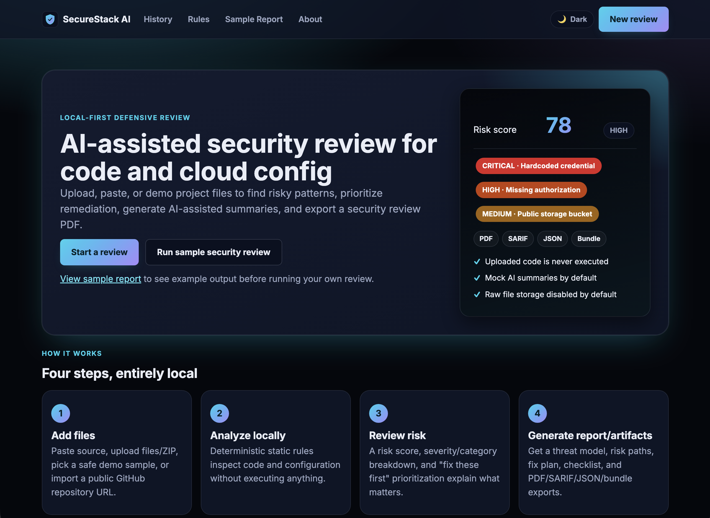
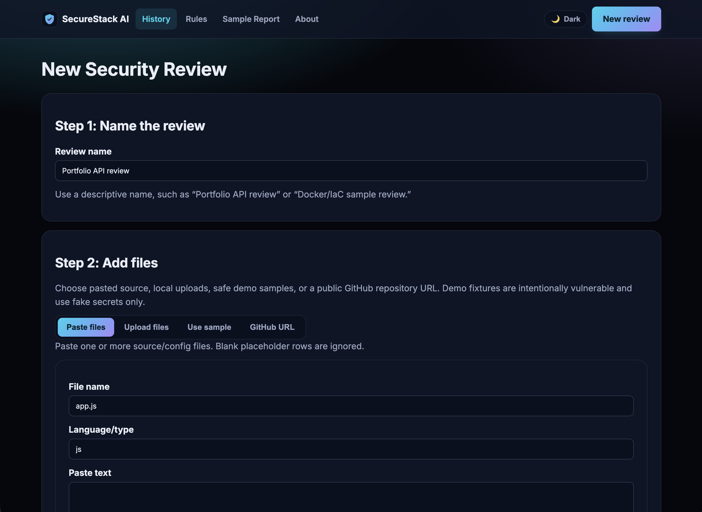
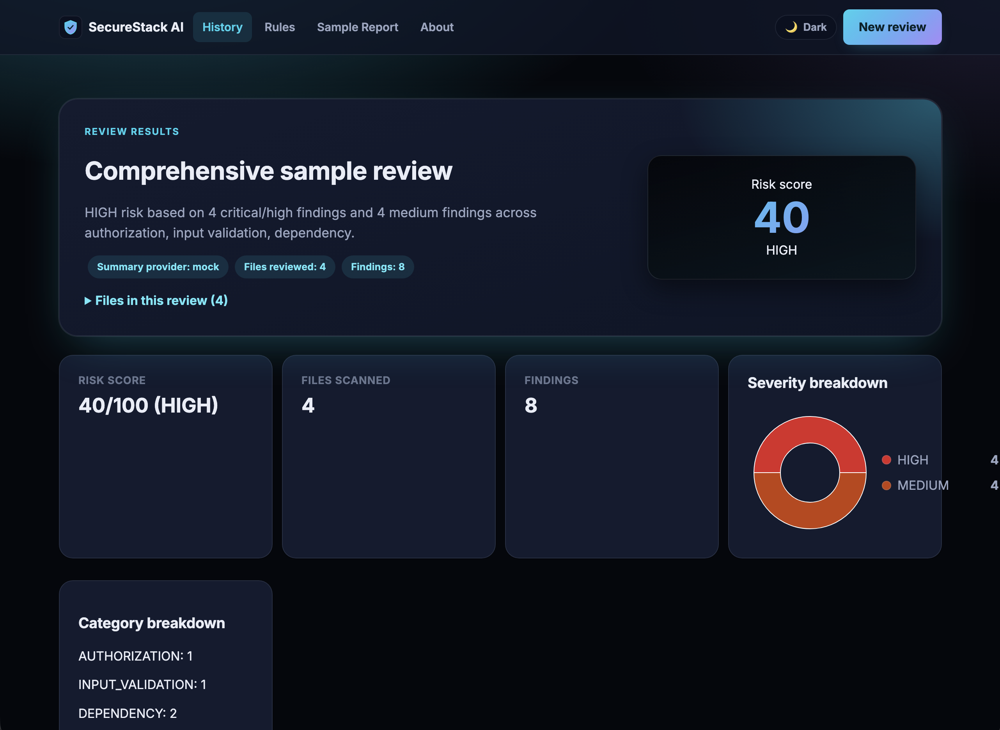
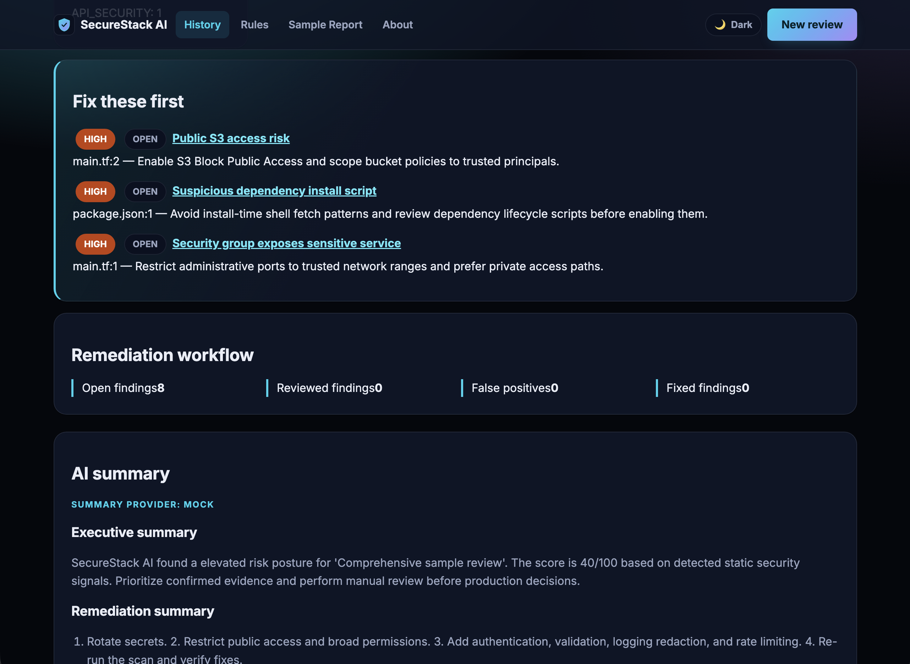
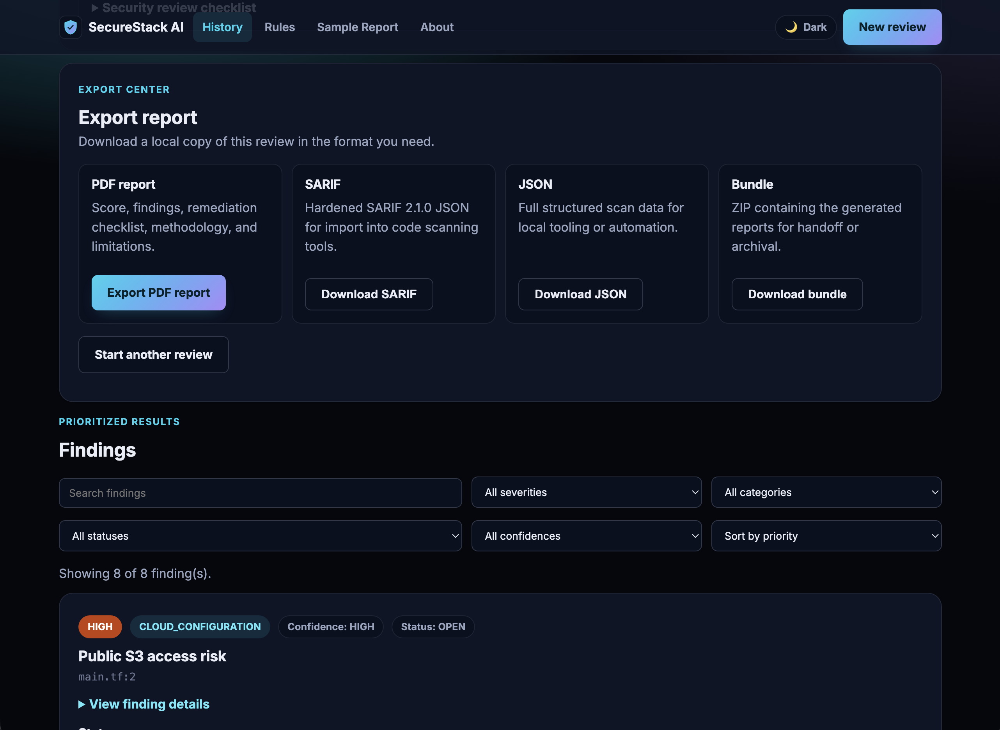
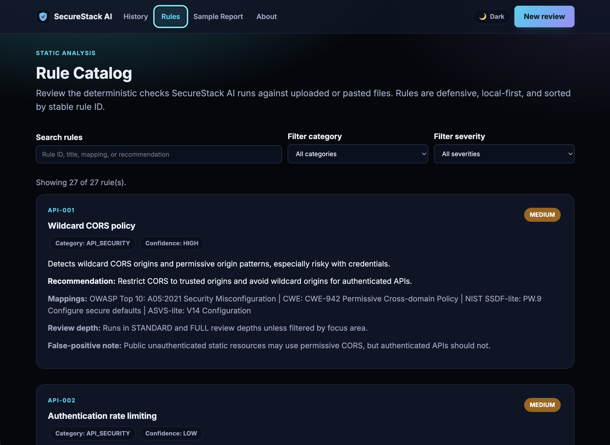
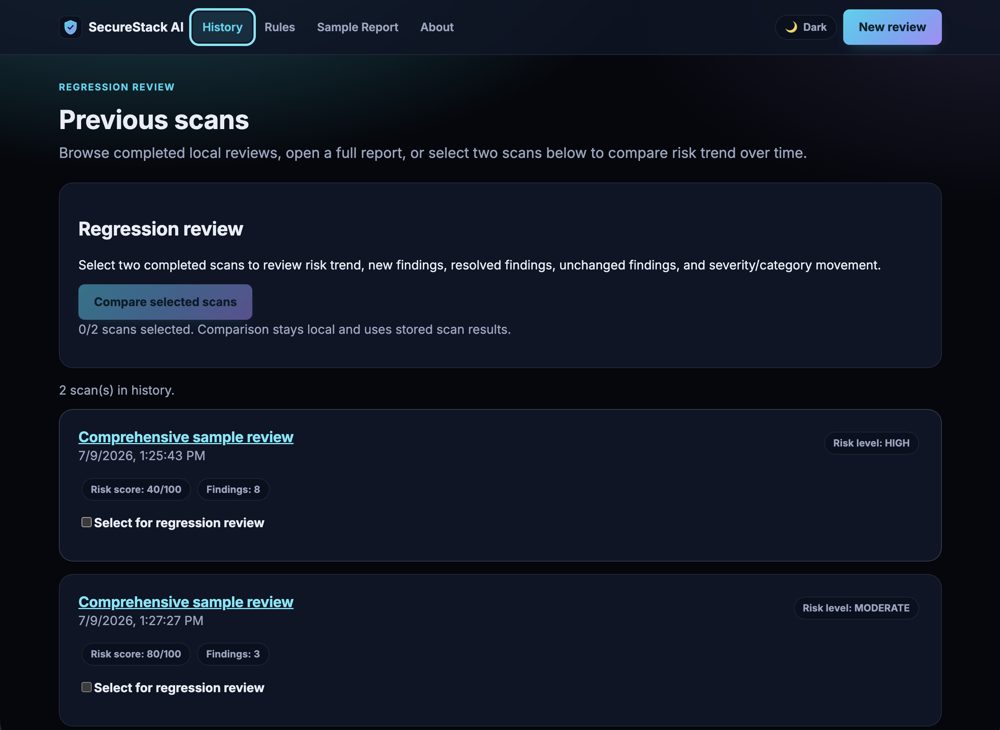
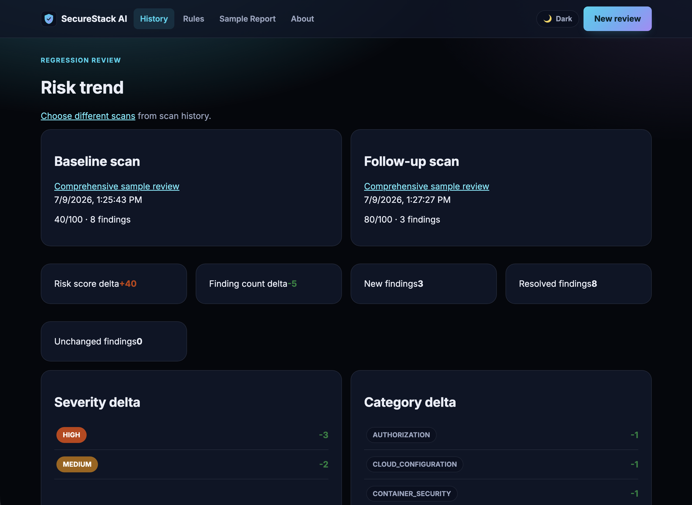
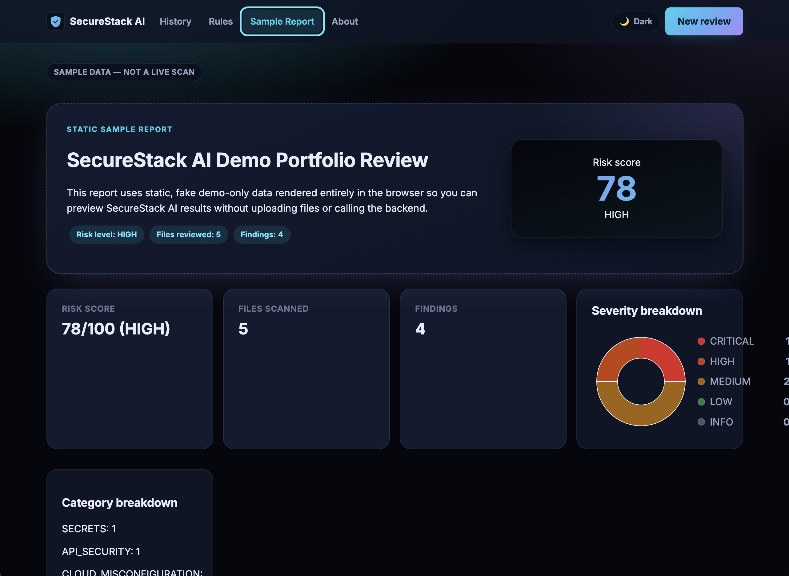
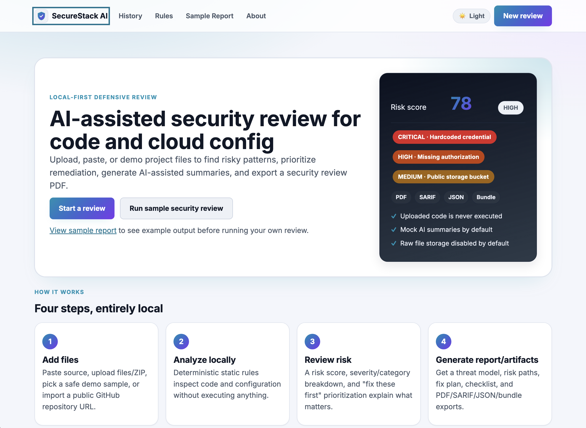

# SecureStack AI

SecureStack AI v0.8.0-beta is a local-first defensive security review application for analyzing source and configuration files. It combines a React/Vite frontend, Java 21 Spring Boot API, deterministic static security rules, mock AI summaries by default, optional Amazon Bedrock summaries, and local report exports.

## Features

- Guided scan creation from pasted files, uploaded files/ZIP archives, built-in safe demo samples, or public GitHub repository URLs imported for local analysis of public-only repositories.
- Expanded static checks for secrets, authentication/session risks, API security, dependency scripts, Dockerfiles, cloud/IaC configuration, logging/data exposure, and input-validation patterns, with a searchable backend/frontend rule catalog.
- Risk scoring, severity/category breakdowns, prioritized findings, threat model, defensive risk paths, fix plan, security review checklist, and local regression comparison between completed scans for risk trend, new findings, resolved findings, and unchanged findings.
- Finding details with masked evidence, remediation guidance, secure examples, status updates, remediation workflow counts, rule IDs, and fix-plan inputs.
- Mock AI summaries by default, with optional manually configured Amazon Bedrock summaries.
- Real sample report page plus PDF, SARIF, JSON, and ZIP bundle exports for completed reviews.
- Dark-first redesigned frontend with a light mode option, shared UI components (cards, badges, page headers, empty/error/loading states), design tokens, keyboard-navigable controls, visible focus states, and severity indicators that always pair color with text.
- One-command local validation, duplicate/copy artifact guardrails, conservative secret checks, Docker Compose config validation, and GitHub Actions CI validation.

## Tech stack

- **Frontend:** React, TypeScript, Vite, React Router, TanStack Query, Vitest, Testing Library, with a shared component library and CSS design tokens under `frontend/src/components/ui/` and `frontend/src/styles/`.
- **Backend:** Java 21, Spring Boot, Spring Web, Spring Data JPA, default H2 persistence, optional local PostgreSQL profile, Maven.
- **Security analysis:** Rule classes for deterministic defensive findings plus risk scoring and provider-abstracted AI summaries.
- **Reporting:** Server-generated PDF export, backend SARIF 2.1.0 export, SecureStack JSON export, and ZIP export bundle.
- **Local runtime:** Docker Compose / Docker Desktop.
- **Optional cloud AI:** Amazon Bedrock when manually configured.

## Tooling expectations

Use Java 21 with Maven for the backend, Node.js 20 or newer with npm for the frontend, and Docker Compose through Docker Desktop or the Docker CLI for local container validation. The repository includes `.java-version` and `.nvmrc` so common tool-version managers select Java 21 and Node 20 automatically.

For normal validation, use `npm ci` in `frontend/` so installed packages match `package-lock.json`. Avoid ad hoc `npm install` unless intentionally updating frontend dependencies and reviewing the resulting lockfile changes. Use `mvn test` for backend test validation and `mvn package` when verifying the packaged backend artifact.

## Quick start

For a clean-machine evaluation, clone the repository, run validation, and then start the local Docker Compose stack:

```bash
git clone https://github.com/bcalford/securestack-ai.git
cd securestack-ai
./scripts/validate-all.sh
docker compose up --build
```

Open `http://localhost:5173` and run the guided sample review. The validation command installs frontend dependencies with `npm ci` when `frontend/node_modules` is missing, runs backend and frontend checks, and validates Docker Compose configuration before the app is started.

## Local validation

Run the full local validation workflow with one command:

```bash
./scripts/validate-all.sh
make validate
```

For a faster loop that skips backend packaging and frontend production build:

```bash
./scripts/validate-all.sh --quick
make validate-quick
```

The validation workflow includes duplicate/copy-file guardrails, conservative secret-safety checks, backend tests, frontend lint/tests/build, and Docker Compose configuration checks. GitHub Actions CI mirrors these validation categories for pushes and pull requests to `main`. The duplicate-file guard detects common accidental duplicate names such as `ApiController 2.java`, `SarifService 3.java`, `main 2.css`, `component copy.tsx`, `*.orig`, and `*.rej`; it skips `.git`, `node_modules`, `frontend/dist`, and `backend/target`, and reports matches without deleting files or claiming to know their root cause. Optional local pre-commit hooks can be installed with `./scripts/install-hooks.sh`.

## Local development

Backend:

```bash
cd backend
mvn spring-boot:run
```

Frontend:

```bash
cd frontend
npm ci
npm run dev
```

The backend runs on `http://localhost:8080`. The Vite dev server runs on `http://localhost:5173` and proxies `/api` requests to the backend.

## Guided demo

For the fastest reviewer walkthrough:

1. Start the app with `docker compose up --build` and open `http://localhost:5173`.
2. Click **Run sample security review** on the landing page, or open `/scans/new?sample=full-portfolio-demo`.
3. Confirm the intentionally vulnerable demo fixture files are preloaded. The sample uses fake demo-only secrets.
4. Run the review and inspect the risk score, severity/category breakdowns, and **Fix these first** findings.
5. Expand finding details to review masked evidence, recommendations, secure examples, status, confidence, and rule IDs.
6. Open the threat model, risk paths, fix plan, and security review checklist to see how findings become remediation guidance.
7. Browse **Rules** for the rule catalog, then open **Review history** to compare completed scans when two scans are available.
8. Export the PDF report, SARIF, SecureStack JSON, or ZIP bundle from the results page.

The sample report page provides a static report-style preview without uploading files or calling the backend. SecureStack AI is local/demo-oriented: uploaded code is not executed, mock AI is the default, raw file storage is disabled by default, and the app is not a hosted scanner.

## Screenshots

### Landing page



### New review flow



### Results overview



### Finding details



### Export center



### Rule catalog



### Scan history



### Regression comparison



### Sample report



### Light mode option



## Optional Bedrock mode

Mock AI is the default and requires no AWS credentials. Bedrock is optional and configured manually:

```bash
AI_PROVIDER=bedrock \
AWS_REGION=us-east-1 \
BEDROCK_MODEL_ID=amazon.nova-lite-v1:0 \
BEDROCK_SEND_RAW_CONTENT=false \
mvn spring-boot:run
```

Keep `BEDROCK_SEND_RAW_CONTENT=false` for private code and sample reviews. Do not commit credentials or use real secrets in sample files.

## Documentation

- [Rule catalog](docs/rule-catalog.md)
- [Technical review guide](docs/technical-review-guide.md)
- [Security model](SECURITY_MODEL.md)
- [Architecture](ARCHITECTURE.md)

## Architecture

The frontend submits pasted or uploaded files to the backend scan API. The backend validates untrusted inputs, rejects unsafe paths and unsupported/binary/oversized files, expands ZIP files safely, runs rule-based analysis, stores scan and finding metadata locally, generates a mock or Bedrock summary, and serves results plus PDF, SARIF, JSON, and bundle exports, and generates defensive review artifacts.

See [`ARCHITECTURE.md`](ARCHITECTURE.md), [`SECURITY_MODEL.md`](SECURITY_MODEL.md), and [`docs/aws-architecture-blueprint.md`](docs/aws-architecture-blueprint.md).

## Security model

- Local/demo-oriented and unauthenticated.
- Uploaded code is not executed.
- File size limits, extension checks, binary rejection, path traversal protection, and ZIP file-count limits are enforced.
- Secret-like evidence is masked in findings and reports.
- Raw file-content storage is disabled by default.
- Bedrock raw-content mode is disabled by default.
- Markdown summaries render without raw HTML passthrough; PDF content is escaped before rendering.

## Limitations

- No authentication or authorization.
- No public deployment or hosted scanner.
- Public GitHub URL import is limited to unauthenticated public repositories; there is no private repo support, OAuth flow, token handling, GitHub App, or GitHub code scanning integration.
- No OpenAI provider.
- No Semgrep execution or integration. SARIF support is export-only; SARIF import and GitHub code scanning upload/automation are not implemented.
- No multi-user production storage.
- No production AWS deployment automation.

## Documentation

- [`ARCHITECTURE.md`](ARCHITECTURE.md)
- [`SECURITY_MODEL.md`](SECURITY_MODEL.md)
- [`ROADMAP.md`](ROADMAP.md)
- [`docs/local-validation.md`](docs/local-validation.md)
- [`docs/github-url-import.md`](docs/github-url-import.md)
- [`docs/scan-comparison.md`](docs/scan-comparison.md)
- [`docs/rule-catalog.md`](docs/rule-catalog.md)
- [`docs/sarif-export.md`](docs/sarif-export.md)
- [`docs/threat-model.md`](docs/threat-model.md)
- [`docs/fix-plan.md`](docs/fix-plan.md)
- [`docs/security-review-checklist.md`](docs/security-review-checklist.md)
- [`docs/export-bundle.md`](docs/export-bundle.md)
- [`docs/postgres-profile.md`](docs/postgres-profile.md)
- [`docs/demo-script.md`](docs/demo-script.md)
- [`docs/technical-review-guide.md`](docs/technical-review-guide.md)
- [`docs/sample-findings.md`](docs/sample-findings.md)
- [`docs/troubleshooting.md`](docs/troubleshooting.md)
- [`docs/aws-architecture-blueprint.md`](docs/aws-architecture-blueprint.md)
- [`docs/deployment-aws.md`](docs/deployment-aws.md)
- [`docs/v0.3-release-notes.md`](docs/v0.3-release-notes.md)
- [`docs/v0.4-release-notes.md`](docs/v0.4-release-notes.md)
- [`docs/v0.5.1-release-notes.md`](docs/v0.5.1-release-notes.md)

### Security review artifacts

Completed scans expose deterministic backend-generated review artifacts in the results UI. The frontend loads the threat model, risk paths, fix plan, and security review checklist from the scan-specific artifact endpoints and presents them as concise collapsible sections. These artifacts use defensive wording only, are based on stored findings, and are intended to help prioritize remediation without providing exploit instructions.
